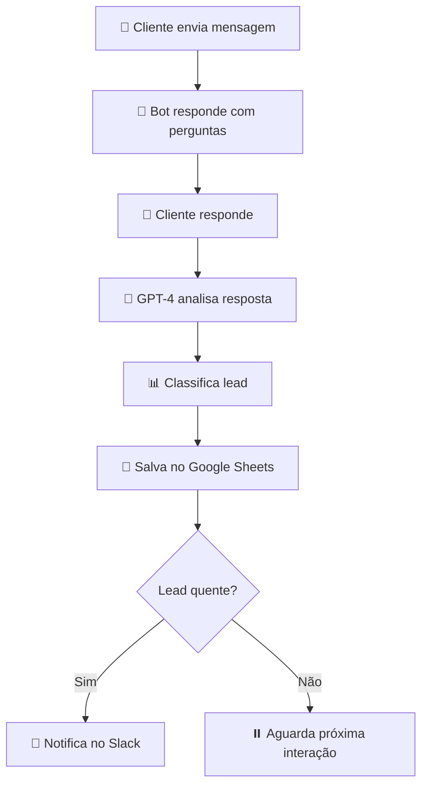

# 🤖 WhatsApp Lead Automation

> **Automatize seu atendimento no WhatsApp com inteligência artificial**

Uma solução completa para pequenos negócios automatizarem a qualificação de leads no WhatsApp, utilizando IA para classificar clientes e integração com ferramentas de produtividade.

## 🚀 Funcionalidades

✅ **Atendimento Automatizado** - Resposta instantânea no WhatsApp  
✅ **Qualificação Inteligente** - Classificação de leads com GPT-4  
✅ **Integração Google Sheets** - Armazenamento automático de dados  
✅ **Notificações Inteligentes** - Alertas para leads quentes via Slack  
✅ **Setup Simplificado** - Configuração com Docker em minutos  

## 🛠️ Tecnologias

| Ferramenta | Função |
|------------|--------|
| **n8n** | Orquestração de workflows |
| **WhatsApp API** | Integração com WhatsApp |
| **Google Sheets** | Banco de dados de leads |
| **OpenAI GPT-4** | Classificação inteligente |
| **Slack** | Notificações em tempo real |
| **Docker** | Containerização |
| **ngrok** | Exposição de webhooks |

## 📋 Pré-requisitos

- [Docker](https://docker.com) instalado
- Conta [OpenAI](https://openai.com) (GPT-4)
- Conta [Google Cloud](https://cloud.google.com) (Sheets API)
- Conta [Slack](https://slack.com) (opcional)
- [ngrok](https://ngrok.com) para desenvolvimento

## ⚡ Instalação Rápida

### 1️⃣ Clone o repositório
```bash
git clone https://github.com/LeonardoCAlmeida/n8n-automation-whatsapp.git
cd whatsapp-lead-automation
```

### 2️⃣ Configure as variáveis de ambiente
```bash
cp .env.example .env
# Edite o arquivo .env com suas credenciais
```

### 3️⃣ Inicie os serviços
```bash
docker-compose up -d
```

### 4️⃣ Acesse o painel n8n
Abra [http://localhost:5678](http://localhost:5678) e faça login com as credenciais do `.env`

### 5️⃣ Importe o workflow
1. No painel n8n, clique em **"Import from file"**
2. Selecione `n8n/workflows/atendimento-whatsapp.json`
3. Configure as credenciais necessárias

## 🔄 Como Funciona



### Classificação de Leads
- **🔥 Quente**: Cliente com urgência e orçamento definido
- **🌡️ Morno**: Cliente interessado, mas sem pressa
- **❄️ Frio**: Cliente apenas coletando informações

## ⚙️ Configuração

### Variáveis de Ambiente (.env)
```env
# Acesso ao n8n
N8N_BASIC_AUTH_USER=seu-email@gmail.com
N8N_BASIC_AUTH_PASSWORD=sua-senha-segura

# ngrok para webhooks
NGROK_AUTHTOKEN=seu-token-ngrok
WEBHOOK_TUNNEL_URL=sua-url-ngrok

# Host da aplicação
N8N_HOST=localhost
```

### Credenciais Necessárias no n8n
1. **OpenAI** - API Key para GPT-4
2. **Google Sheets** - Service Account JSON
3. **WhatsApp API** - Token de acesso
4. **Slack** - Webhook URL (opcional)

## 📊 Dados Coletados

| Campo | Descrição |
|-------|-----------|
| **Telefone** | Número do WhatsApp do lead |
| **Mensagem** | Resposta completa do cliente |
| **Timestamp** | Data/hora do contato |
| **Classificação** | Quente/Morno/Frio (GPT-4) |

## 🔧 Personalização

### Modificar Perguntas
Edite o node **"Enviar Perguntas WhatsApp"** no workflow n8n:

```javascript
// Exemplo de perguntas personalizadas
"Olá! Para um atendimento personalizado:\n" +
"1. 👤 Qual seu nome e empresa?\n" +
"2. 🎯 Qual seu principal desafio?\n" +
"3. 💰 Qual seu orçamento estimado?\n" +
"4. ⏰ Qual a urgência do projeto?"
```

### Ajustar Classificação IA
Modifique o prompt do GPT-4 no node **"Classificar Lead GPT-4"**:

```javascript
"Analise esta resposta de um potencial cliente: {{$json["body"]}}.\n" +
"Classifique como:\n" +
"- 'quente': urgência alta + orçamento definido\n" +
"- 'morno': interesse real + sem pressa\n" +
"- 'frio': apenas informação + sem compromisso\n" +
"Responda APENAS: quente, morno ou frio"
```

## 🚨 Troubleshooting

### Problemas Comuns

**n8n não inicia**
```bash
docker-compose down && docker-compose up -d
```

**Webhook não recebe mensagens**
- Verifique se o ngrok está ativo
- Confirme a URL no webhook do WhatsApp

**GPT-4 não responde**
- Verifique o saldo da conta OpenAI
- Confirme a API Key nas credenciais

**Google Sheets não salva**
- Verifique as permissões da planilha
- Confirme o Service Account JSON

## 📈 Próximos Passos

- [ ] Integração com CRM (Pipedrive, HubSpot)
- [ ] Dashboard de métricas em tempo real
- [ ] Respostas personalizadas por tipo de lead
- [ ] Integração com WhatsApp Business API
- [ ] Multi-idiomas com tradução automática

## 🤝 Contribuição

1. Fork o projeto
2. Crie uma branch (`git checkout -b feature/nova-funcionalidade`)
3. Commit suas mudanças (`git commit -m 'Adiciona nova funcionalidade'`)
4. Push para a branch (`git push origin feature/nova-funcionalidade`)
5. Abra um Pull Request

## 📄 Licença

Este projeto está sob a licença MIT. Veja o arquivo [LICENSE](LICENSE) para detalhes.

## 💬 Suporte

- 📧 **Email**: leoengunitau@gmail.com
- 💼 **LinkedIn**: [Leonardo Almeida](https://linkedin.com/in/leonardo-almeida)
- 🐛 **Issues**: [GitHub Issues](https://github.com/LeonardoCAlmeida/n8n-automation-whatsapp/issues)

---

⭐ **Gostou do projeto? Deixe uma estrela no GitHub!**
